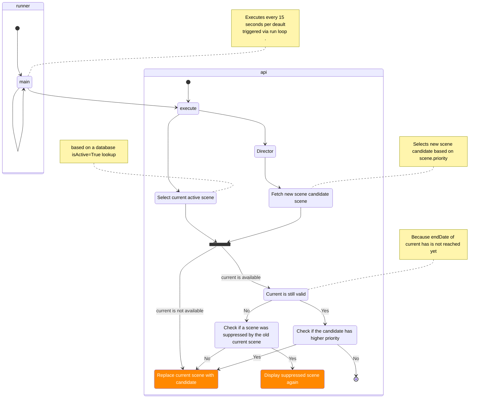

## vestascenes 🚀

This vestaboard server implementation organizes your content related to the vestaboard (http://vestaboard.com) within scenes.

This helps you prioritize the content you are interested in. The implementation contains scenes for ChatGPT requests, Strava statistics and some other random content-generating scenes. As soon as a specific event occurs within a scene, the "time-based content" will be displayed. Otherwise, random content will be displayed.


### Key concept
The key concept behind the app is a Director who determines and executes the next best scene on a regular basis. Each scene announces with its priority how important the current scene content is. The Director will consider this information to calculate which scene is next. The main logical flow is described within the following diagram:




### Container Setup
The application is orchestrated by docker-compose and is currently organized into two main applications:
#### API
Contain the business logic of vesta-control. The API is implemented with FastAPI and contains multiple endpoints. check: http://127.0.0.1:8000/docs for detailed service descriptions

 
#### Runner
The runner is a container with one python application which is triggering the http://api/execute endpoint every 15 seconds. Thanks to this the application logic resists within the api container and is triggered periodically within the given interval.


#### Web
This is still TODO. The idea is to create a little web frontend for the API to provide manual messages. I'd start with npm create vite - you can either mount the built files npm run build into nginx directly (recommended) or play around with base node container (docker init ) and run npm run serve as entry point 
Include official components https://storybook.vestaboard.com/?path=/docs/docs--docs

### Known Issues / Todos
- Create a Scene to display Space Launch Alerts (display when a SpaceX liftoff happens)
- StravaLastActivityScene: update activity title even when the scene is active -> will take normal dennis routine into account :)
- Create scene which shows a countdown towards specific events (example festival countdown, vacations etc.)
- optimize init-snapshots performance
- create web frontend

## Cheat Sheet
### Debugging / deploy tips:
If you take synology package manager into account the following commands will rebuild the container:
```bash
# Manual start on Mac:
sudo docker-compose up --build -d

# get all log statements of running containers
docker-compose logs -f

# check which containers are up and running
sudo docker-compose watch

# log interactively into container
docker exec -ti vestaboard-api-1 /bin/sh

########## fetch new sources from git and rebuild ##########
# stop current project in container manager!
cd /volume1/docker/vestaboard/

# remove local git changes (if required)
git restore .

# refresh rom git
git pull origin main

# rebuild the container:
sudo docker-compose build --no-cache api

# trigger "Aktion -> Bereinigen" of the project
# trigger "Aktion -> Erstellen" of the project
```

### Character Codes
https://docs.vestaboard.com/docs/characterCodes
